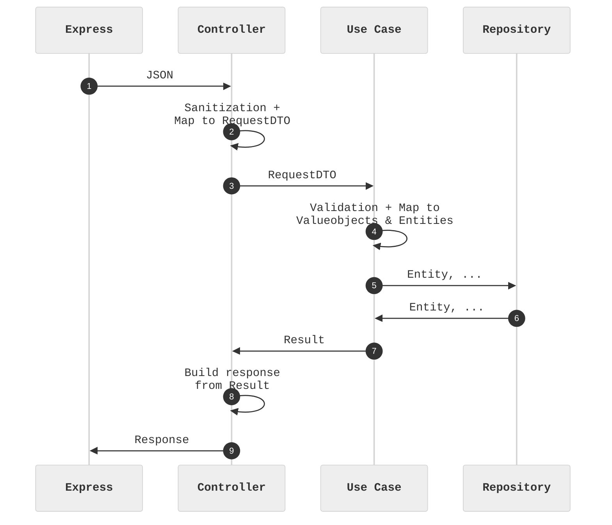

# Clean Architecture x node

## About the project

This project is originally meant to be used to learn **Clean Architecture**, but aims to improve continuously and serve as a **node.js boilerplate** with the following features :

- [x] Based on node.js + TypeScript + express
- [x] Inversion of Control with inversify
- [x] Based on [Clean Architecture]()
- [ ] Based on the [12-Factor App principles]()
- [x] node.js clustering

*Comments, suggestions and feature proposals are welcome.*

 

## Project structure

I organized the project structure according to my understanding of the Clean Architecture rules and concepts.

    .
    ├── 📁 src
    │   ├── main.ts                 # Application Entry Point / Composition Root
    │   ├── 📁 config               # Configuration
    │   ├── 📁 ioc                  # Inversion of control container and bindings
    │   ├── 📁 modules              # Business and Domain features by subdomain
    │   │   └── 📁 users            # Users subdomain
    │   │       ├── 📁 common       # Interfaces, abstractions and other...
    │   │       ├── 📁 createUser   # Controller, Use case interactor, Request & Response objects...
    │   │       └── 📁 loginUser    # Controller, Use case interactor, Request & Response objects...
    │   └── 📁 shared       
    │
    ├── 📁 tests                    # Tests
    └── ...

 

## Flow

 

## Conventions

### Naming conventions

| Element | Convention | Example |
| --- | --- | --- |
| Default | camelCase | userRouter.ts |
| Interfaces | PascalCase | IController.ts |
| Classes | PascalCase | Controller.ts |
| Abstract classes | PascalCase | BaseController.ts |

### Linting conventions

- Indentation : 4 spaces

 